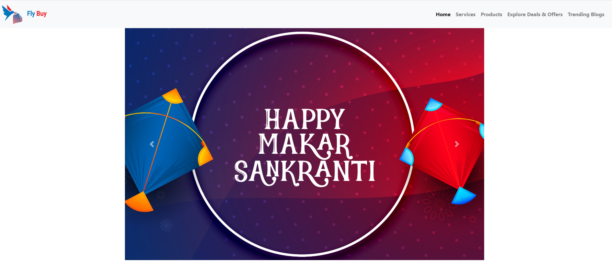
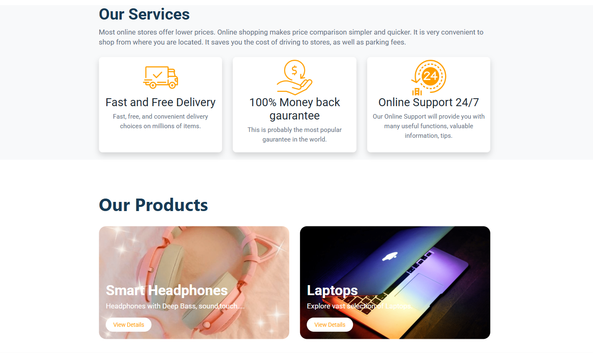

# 🛍️ Static E-Commerce Website ✨

A foundational, fully **responsive static e-commerce website template** engineered with pure HTML and CSS. This project serves as a clear demonstration of core front-end proficiency, built for **rapid prototyping** and efficient performance.

---

## 🚀 View Live Demo

Click the button below to interact with the deployed version and see the responsiveness in action:

[](git)
<br>

---

## 🎯 Technical Showcase: Skills Demonstrated

This project intentionally uses a minimal stack to isolate and emphasize fundamental front-end skills:

| Skill Focus | Implementation Details |
| :--- | :--- |
| **HTML5** | Used modern tags to ensure **accessibility** and clear content organization. |
| **Responsive Design** | Achieved a seamless, mobile-first layout using **Bootstrap5 Flex-Box** to adjust styles for mobile, tablet, and desktop viewports. |
| **CSS Grid Mastery** | Utilized **Bootstrap Grid** for the product listing section, creating a robust, flexible, and adaptive card layout. |
| **Performance Optimization** | The static nature guarantees extremely **fast load times** and a minimal resource footprint. |

---

## 📸 Screenshots of the Website 




---

## 💡 Features and Architecture

* **✔️ Single-Page Layout:** A classic storefront structure including a header, a product grid, and a footer.
* **⚡ High Performance:** Static deployment results in maximum speed and reliability.
* **🎨 Clean Styling:** Minimal, well-commented CSS for easy readability and customization.
* **📐 Minimalist Stack:** No dependencies—simply open `index.html` in any browser.

---
## File Structure
```
E-COMMERCEWEBSITE/
├── E-comscreenshots/
│ ├── desktop.ini
│ ├── Screenshot1.png
│ ├── Screenshot2.png
│ └── Screenshot3.png
├── index.html
├── README.md
└── style.css
```

---

## 🛠️ Getting Started

To review the source code locally:

1.  **Clone or Download:** Retrieve the repository files.
2.  **Launch:** Open `index.html` directly in your web browser to view the template.

---

## ⏭️ Potential Next Steps (Future Development)

For a full e-commerce solution, this template is ready to be integrated with:

* **JavaScript:** To introduce dynamic features like a **shopping cart**, product filters, and image carousels.
* **A Headless CMS:** To manage product data externally and hydrate the static HTML.
